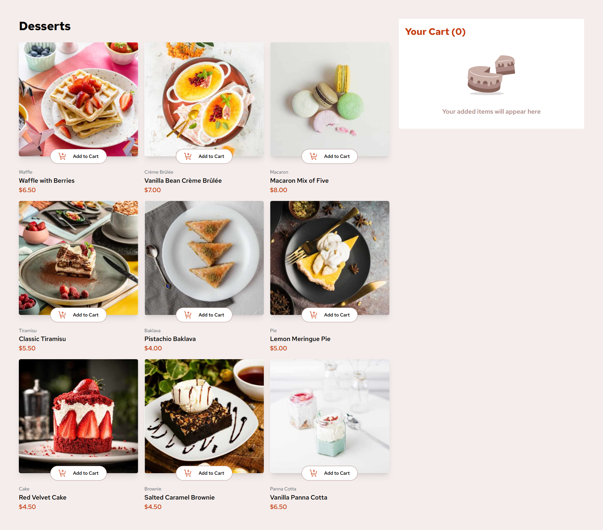
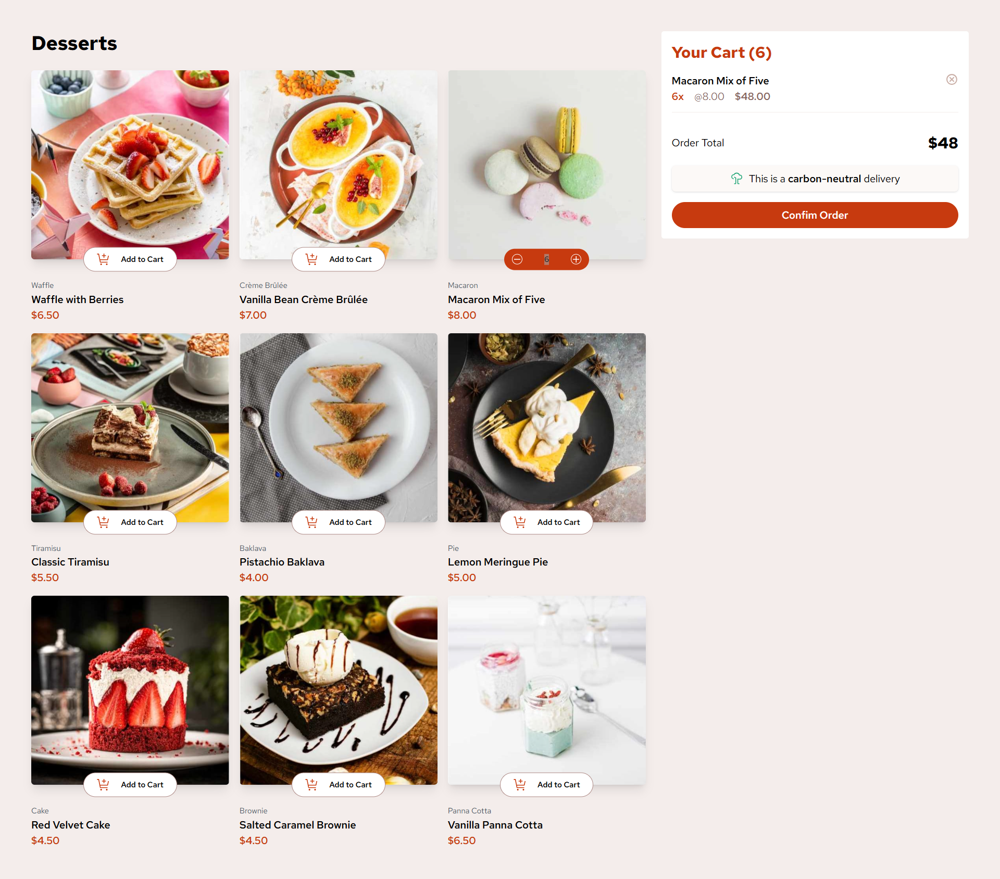
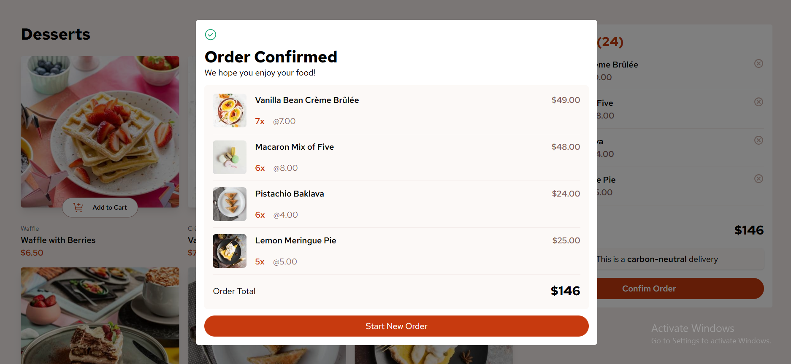

# Frontend Mentor - Product list with cart

## Overview

### The challenge

### Screenshot

***Empty Item selected***

***Item selected***

***Confirmed Modal***

### Links

- Solution URL: [solution URL here](https://github.com/molindu/product-list-with-cart.git)
- Live Site URL: [live site URL here](https://molindu.github.io/product-list-with-cart/)

## My process

### Built with

- Mobile-first workflow
- [React](https://reactjs.org/) - JS library
- [Zustand](https://zustand.docs.pmnd.rs/) - zustand doc

### Useful resources

- [React with Vite](https://vite.dev/guide/) - I started react with vite

## Author

- Website - [Molindu Yasoda](https://github.com/molindu/product-list-with-cart.git)

## Other project for references

- 

